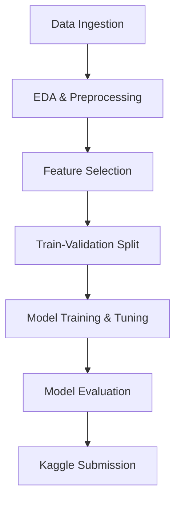

# 🏦 Bank Customer Churn Prediction

[](LICENSE)  
  


> Predicting which bank customers are at risk of churning using advanced machine learning models.

---

## 📌 Project Overview

Customer retention is crucial for the banking industry, as acquiring new clients is significantly more expensive than retaining existing ones. This project leverages machine learning to predict the likelihood of a customer leaving (churning), based on their demographic and account-related attributes.

Our pipeline includes data cleaning, exploratory data analysis (EDA), feature engineering, handling imbalanced classes, training multiple ML models, and model evaluation using AUC-ROC. The best model was CatBoost, which achieved an AUC score of **0.8847** on the Kaggle test set.

---

## 📊 Dataset

- Source: [Kaggle - Playground Series S4E1](https://www.kaggle.com/competitions/playground-series-s4e1/data)
- Rows: ~165,000 (training), separate test set provided
- Target: `Exited`  
  - 1 = Churned  
  - 0 = Retained

Key features include:
- Demographics: `Age`, `Gender`, `Geography`
- Account Info: `Balance`, `Tenure`, `IsActiveMember`, `HasCreditCard`, `NumOfProducts`

---

## 🔍 Exploratory Data Analysis (EDA)

- **Univariate Analysis**: Histogram and bar charts to understand variable distribution
- **Bivariate Analysis**: Insights into customer churn by age, credit score, activity status, etc.
- **Correlation Analysis**: Highlighted strong positive correlation of age with churn and strong negative correlation of activity and product count.

---

## 🧹 Data Preprocessing

- Dropped irrelevant columns (`CustomerId`, `Surname`, `RowNumber`)
- One-Hot Encoding of categorical features
- Feature Scaling using `StandardScaler`
- Handled class imbalance using **SMOTE (Synthetic Minority Over-sampling Technique)**

---

## 🧠 Models Trained

A total of 15 models were trained and evaluated using the **AUC-ROC** metric:

| Model                  | AUC Score  |
|------------------------|------------|
| Logistic Regression    | 0.799      |
| Random Forest          | 0.8790     |
| MLP Classifier         | 0.8792     |
| XGBoost                | 0.8864     |
| **CatBoost (Best)**    | **0.8886** |

The CatBoost model was fine-tuned using **GridSearchCV** and achieved **0.88478** AUC on the Kaggle test dataset.

---

## 🧾 Feature Importance (CatBoost)

Top contributing features for churn prediction:

1. **IsActiveMember**: Inactive customers more likely to churn  
2. **Age**: Older customers showed higher churn rates  
3. **HasCreditCard**: Customers with a credit card were less likely to churn  
4. **NumOfProducts**, `Balance`, `Geography`: Moderately important

---

## 🛠 Project Workflow



---

## 🔮 Future Work

- Explore **ADASYN** and **RandomUnderSampling** for class balancing
- Advanced feature engineering to discover interaction terms
- Implement hybrid ensemble approaches (stacking/blending)
- Segment-based modeling (predict separately for customer clusters)

---

## 📂 Repository Structure

```
📦Bank-Customer-Churn
 ┣ 📁data
 ┃ ┣ train.csv
 ┃ ┣ test.csv
 ┣ 📁notebooks
 ┃ ┣ eda.ipynb
 ┃ ┣ model_training.ipynb
 ┣ 📁models
 ┃ ┣ catboost_model.pkl
 ┣ 📄README.md
 ┣ 📄requirements.txt
 ┣ 📄churn_predictor.py
 ┣ 📄LICENSE
```

---

## 🚀 Getting Started

### Prerequisites
```bash
pip install -r requirements.txt
```

### Run Model
```bash
python churn_predictor.py --input data/test.csv --model models/catboost_model.pkl
```

---

## 👨‍💻 Authors

- **Sridipta Roy** – [roy.sr@northeastern.edu](mailto:roy.sr@northeastern.edu)  
- **Syeda Tooba Ali** – [ali.syeda@northeastern.edu](mailto:ali.syeda@northeastern.edu)

---

## 📚 References

1. Vu, VH. *An Efficient Customer Churn Prediction Technique*. [OR Forum 2024](https://doi.org/10.1007/s43069-024-00345-5)  
2. De Caigny et al., *Hybrid Logistic-Tree Models*, EJOR, 2018  
3. Huseyinov & Okocha, *Prediction of Bank Customer Churn*, IISEC 2022  
4. Soni & Nelson, *Profit-Driven Churn Prediction*, IJPE 2023  
5. Bhuria & Gupta, *Voting Classifier for Churn Prediction*, Discover Sustainability 2025